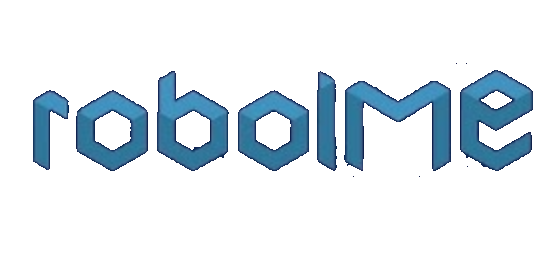

# 🤖 RoboIME HSL2025 - Sistema de Futebol Robótico

<div align="center">




**Sistema Avançado de Robô Humanóide para Futebol - YOLOv8 Simplificado**
*Otimizado para NVIDIA Jetson Orin Nano Super + ROS2 Humble*

</div>

## 📋 Índice

- [🔍 Visão Geral](#-visão-geral)
- [🏗️ Arquitetura do Sistema](#️-arquitetura-do-sistema)
- [💻 Requisitos do Sistema](#-requisitos-do-sistema)
- [🚀 Instalação e Uso](#-instalação-e-uso)
  - [🐳 Usando Docker (Recomendado)](#-usando-docker-recomendado)
  - [🔧 Instalação Manual](#-instalação-manual)
  - [📦 Configuração do Ambiente](#-configuração-do-ambiente)
- [▶️ Executando o Sistema](#️-executando-o-sistema)
  - [🚀 Sistema Completo](#-sistema-completo)
  - [🔧 Módulos Individuais](#-módulos-individuais)
- [🔄 Desenvolvimento](#-desenvolvimento)
- [📡 Sincronização com Jetson](#-sincronização-com-jetson)
- [🔍 Solução de Problemas](#-solução-de-problemas)
- [📜 Licença](#-licença)

## 🔍 Visão Geral

O **RoboIME HSL2025** é um sistema completo de robô humanóide para futebol desenvolvido para a **Humanoid Soccer League 2025**. 

### 🎯 **Principais Características:**
- **🧠 Sistema de Percepção YOLOv8 Simplificado**: Detecção de 6 classes essenciais focadas em estratégia e localização
- **🤖 Arquitetura Modular ROS2**: Comportamento, navegação, movimento e percepção independentes
- **⚡ Otimização NVIDIA**: Aceleração CUDA no Jetson Orin Nano Super
- **🐳 Deploy com Docker**: Ambiente consistente e reproduzível
- **📡 Comunicação Customizada**: Sistema roboime_msgs para alta performance

### 🧠 **Sistema de Percepção Inteligente:**
Utiliza **YOLOv8 com 6 classes essenciais** divididas em dois propósitos:

#### **⚽ Estratégia de Jogo (2 classes):**
- 🏐 **Ball** - Bola de futebol (elemento principal)
- 🤖 **Robot** - Robôs (sem distinção de cor - unificado)

#### **🧭 Localização no Campo (4 classes):**
- 📍 **Penalty Mark** - Marca do penalty (landmark preciso)
- 🥅 **Goal** - Gols (estruturas unificadas)
- ⭕ **Center Circle** - Círculo central (referência central)
- 📐 **Field Corner** - Cantos do campo (landmarks de borda)
- 🔲 **Area Corner** - Cantos da área (landmarks internos)

## 🏗️ Arquitetura do Sistema

```
RoboIME HSL2025/
├── 📡 roboime_msgs          # Sistema de comunicação customizada
├── 👁️ perception            # YOLOv8 simplificado (6 classes)
│   ├── ⚽ Estratégia        # Ball + Robot detection
│   └── 🧭 Localização      # Landmarks para navegação
├── 🧭 navigation            # Localização usando landmarks + planejamento
├── 🤖 behavior              # Comportamento e estratégia de jogo
├── 🚶 motion                # Controle de movimento e caminhada
├── 🚀 bringup              # Sistema de inicialização
├── 🐳 docker               # Containerização para Jetson
└── 📜 scripts              # Automação e utilitários
```

## 💻 Requisitos do Sistema

### **🔧 Hardware Necessário:**
- **NVIDIA Jetson Orin Nano Super** (8GB RAM)
- **Câmera CSI IMX219** ou **USB Logitech C930**
- **Servomotores Dynamixel** (recomendado)
- **Cartão microSD** 64GB+ (Classe 10)

### **💿 Software Base:**
- **NVIDIA JetPack 6.2+** (Ubuntu 22.04 LTS)
- **ROS2 Humble Hawksbill**
- **Python 3.10+**
- **CUDA 12.2+**
- **Docker 24.0+**

## 🚀 Instalação e Uso

### 🐳 Usando Docker (Recomendado)

A instalação via Docker garante **ambiente consistente** e **dependências corretas**:

#### **1. Preparação Inicial**
```bash
# Clone o repositório
git clone https://github.com/RoboIME/HSL2025.git
cd HSL2025

# Verificar sistema Jetson
sudo jetson_release

# Instalar Docker (se necessário)
curl -fsSL https://get.docker.com -o get-docker.sh
sudo sh get-docker.sh
sudo usermod -aG docker $USER
```

#### **2. Build da Imagem Docker**
```bash
# Construir imagem otimizada para Jetson
chmod +x scripts/docker-helpers/docker-build.sh
./scripts/docker-helpers/docker-build.sh

# Ou manualmente:
docker build -t roboime_hsl2025:latest -f docker/Dockerfile.jetson .
```

#### **3. Executar Container**
```bash
# Iniciar container com GPU e câmera
chmod +x scripts/docker-helpers/docker-run.sh
./scripts/docker-helpers/docker-run.sh

# Ou manualmente:
docker run -it --runtime nvidia --privileged \
  --device=/dev/video0 \
  --network host \
  --name roboime_container \
  -v $(pwd):/workspace \
  roboime_hsl2025:latest
```

### 🔧 Instalação Manual

Para desenvolvedores que preferem controle total:

#### **1. Configurar ROS2 Humble**
```bash
# Adicionar repositório ROS2
sudo apt update && sudo apt install curl gnupg lsb-release
sudo curl -sSL https://raw.githubusercontent.com/ros/rosdistrib/master/ros.asc | sudo apt-key add -
sudo sh -c 'echo "deb [arch=$(dpkg --print-architecture)] http://packages.ros.org/ros2/ubuntu $(lsb_release -cs) main" > /etc/apt/sources.list.d/ros2-latest.list'

# Instalar ROS2 Humble
sudo apt update
sudo apt install ros-humble-desktop python3-argcomplete

# Configurar ambiente
echo "source /opt/ros/humble/setup.bash" >> ~/.bashrc
source ~/.bashrc
```

#### **2. Instalar Dependências Python**
```bash
# Dependências do sistema
sudo apt install python3-pip python3-colcon-common-extensions

# YOLOv8 e PyTorch para Jetson
pip3 install torch torchvision torchaudio --index-url https://download.pytorch.org/whl/cu121
pip3 install ultralytics>=8.0.0
pip3 install opencv-python>=4.8.0 numpy>=1.24.0 pyyaml>=6.0
```

#### **3. Instalar roboime_msgs**
```bash
# Clonar e instalar mensagens customizadas
cd src/msgs
pip3 install -e .
```

### 📦 Configuração do Ambiente

#### **1. Dentro do Container/Sistema**
```bash
# Navegar para workspace
cd /workspace  # No container
# cd HSL2025   # Instalação manual

# Configurar links de bibliotecas (se necessário)
chmod +x src/perception/setup_library_links.sh
sudo src/perception/setup_library_links.sh

# Configurar rosdep customizado
chmod +x src/perception/setup_rosdep.sh
sudo src/perception/setup_rosdep.sh
```

#### **2. Compilar Pacotes ROS2**
```bash
# Instalar dependências
rosdep update
rosdep install --from-paths src --ignore-src -r -y

# Compilar workspace
colcon build --symlink-install

# Configurar ambiente
source install/setup.bash
echo "source $(pwd)/install/setup.bash" >> ~/.bashrc
```

## ▶️ Executando o Sistema

### 🚀 Sistema Completo

#### **Lançamento Principal**
```bash
# Sistema completo (recomendado)
ros2 launch bringup robot.launch.py

# Com debug visual
ros2 launch bringup robot.launch.py debug:=true

# Sistema com câmera específica
ros2 launch bringup robot.launch.py camera_type:=csi  # CSI IMX219
ros2 launch bringup robot.launch.py camera_type:=usb  # USB C930
```

### 🔧 Módulos Individuais

#### **Sistema de Percepção (YOLOv8 Simplificado)**
```bash
# Câmera CSI (padrão)
ros2 launch perception perception.launch.py

# Câmera USB
ros2 launch perception perception.launch.py camera_type:=usb

# Múltiplas câmeras
ros2 launch perception dual_camera.launch.py

# Com modelo customizado (6 classes)
ros2 launch perception perception.launch.py \
  model_path:=/path/to/robocup_simplified_yolov8.pt \
  confidence_threshold:=0.6
```

#### **Verificar Detecções**
```bash
# Ver todas as detecções
ros2 topic echo /perception/unified_detections

# Detecções estratégicas
ros2 topic echo /perception/ball_detection      # Bola
ros2 topic echo /perception/robot_detections    # Robôs

# Detecções para localização
ros2 topic echo /perception/goal_detections         # Gols
ros2 topic echo /perception/localization_landmarks  # Landmarks

# Visualização
ros2 run rqt_image_view rqt_image_view /perception/debug_image
```

#### **Outros Módulos**
```bash
# Sistema de comportamento
ros2 run behavior behavior_node

# Controlador de movimento
ros2 run motion walking_controller

# Sistema de navegação (quando implementado)
ros2 run navigation localization_node
```

## 🔄 Desenvolvimento

### **📝 Edição de Código**
```bash
# Montar diretório para edição (Docker)
docker run -it --runtime nvidia \
  -v $(pwd):/workspace \
  roboime_hsl2025:latest

# Em outro terminal, edite normalmente
code .  # VS Code
nano src/perception/perception/yolov8_detector_node.py
```

### **🔨 Compilação Incremental**
```bash
# Recompilar pacote específico
cd /workspace  # ou HSL2025
colcon build --symlink-install --packages-select perception

# Recarregar ambiente
source install/setup.bash

# Testar mudanças
ros2 launch perception perception.launch.py debug:=true
```

### **🧪 Testes**
```bash
# Teste interativo do sistema de percepção
chmod +x src/perception/test_perception.sh
./src/perception/test_perception.sh

# Testes individuais
ros2 run perception csi_camera_node
ros2 run perception yolov8_unified_detector
```

## 📡 Sincronização com Jetson

### **Usando Script Automático**
```bash
# Configurar IP da Jetson no script
nano scripts/sync_jetson.sh

# Sincronizar
chmod +x scripts/sync_jetson.sh
./scripts/sync_jetson.sh
```

### **Sincronização Manual**
```bash
# Via rsync (rápido)
rsync -avz --exclude 'build/' --exclude 'install/' --exclude '.git/' \
  ./ jetson@192.168.1.100:/home/jetson/HSL2025/

# Via scp (alternativo)
scp -r src/ jetson@192.168.1.100:/home/jetson/HSL2025/
```

## 🔍 Solução de Problemas

### **🔴 Problemas Comuns**

#### **CUDA/GPU não detectado**
```bash
# Verificar CUDA
nvidia-smi
nvcc --version

# Verificar PyTorch
python3 -c "import torch; print(f'CUDA: {torch.cuda.is_available()}')"

# Reinstalar PyTorch (se necessário)
pip3 uninstall torch torchvision
pip3 install torch torchvision --index-url https://download.pytorch.org/whl/cu121
```

#### **Modelo YOLOv8 não encontrado**
```bash
# Verificar modelo de 6 classes
ls -la src/perception/resources/models/robocup_simplified_yolov8.pt

# Baixar modelo base (temporário - REQUER RETREINAMENTO!)
cd src/perception/resources/models/
wget https://github.com/ultralytics/assets/releases/download/v0.0.0/yolov8n.pt

# Usar modelo padrão
ros2 launch perception perception.launch.py model_path:=yolov8n.pt
```

#### **Câmera não detectada**
```bash
# Verificar dispositivos de vídeo
ls /dev/video*
v4l2-ctl --list-devices

# Testar câmera CSI
gst-launch-1.0 nvarguscamerasrc ! nvoverlaysink

# Testar câmera USB
gst-launch-1.0 v4l2src device=/dev/video0 ! videoconvert ! xvimagesink
```

#### **Problemas de dependências ROS2**
```bash
# Limpar e recompilar
rm -rf build/ install/ log/
rosdep update
rosdep install --from-paths src --ignore-src -r -y
colcon build --symlink-install

# Verificar msgs customizadas
ros2 interface list | grep roboime
```

### **📊 Monitoramento de Performance**
```bash
# CPU e memória
htop
jtop  # Jetson específico

# GPU
nvidia-smi
watch -n 1 nvidia-smi

# FPS do sistema (deve estar melhor com 6 classes)
ros2 topic hz /camera/image_raw
ros2 topic hz /perception/debug_image
```

### **🎯 Performance Esperada (6 Classes vs 11 Classes)**
| Métrica | 11 Classes | 6 Classes | Melhoria |
|---------|------------|-----------|----------|
| **FPS** | 15-20 | 20-25 | **+25-30%** |
| **Latência** | 15-20ms | 10-15ms | **-25-33%** |
| **GPU Usage** | 70-80% | 60-70% | **-10-15%** |
| **RAM Usage** | 2-3GB | 1.5-2GB | **-25-30%** |

## 📜 Licença

Este projeto é licenciado sob a **Licença MIT** - veja o arquivo [LICENSE](LICENSE) para detalhes.

---

<div align="center">
  <p><strong>🤖 Desenvolvido pela Equipe RoboIME</strong></p>
  <p>📍 <em>Instituto Militar de Engenharia (IME) - Rio de Janeiro, Brasil</em></p>
  <p>🎯 <em>YOLOv8 Simplificado • 6 Classes Essenciais • Estratégia + Localização</em></p>
  <p>🏆 <em>Humanoid Soccer League 2025</em></p>
</div>
